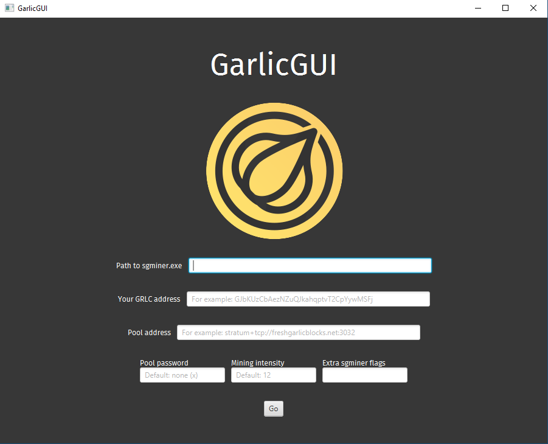
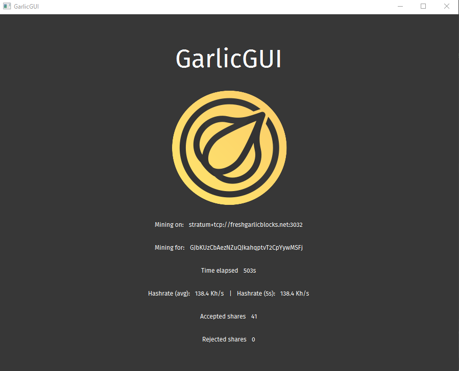

# GarlicGUI

A simple GUI for the Garlicoin pool miners (SGMiner and CCMiner)

# Read before using

 - **Currently Windows only**
 - **Java needs to be installed to be able to run Garlicium-Mining-GUI**

*Notes about the app:*

 - The default mining intensity is 12
 - The IP:Port used for the API is `127.0.0.1:4028`
 - Test that the miner works by itself before using this GUI
 - Make sure `Settings/Settings.ser` exists in the same directory as `Garlicium-Mining-GUI.jar`
 - You can use the "Extra miner flags" box to put extra flags such as pool username & password, max-temp for Nvidia GPUs, etc.

*The GUI only supplies these options to the miner by default:*

 - `--algorithm scrypt-n --nfactor 11` or `--algo=scrypt:10`
 - `-o POOL_ADDRESS`
 - `-u GRLC_ADDRESS`
 - `-I MINING_INTENSITY` or `-i MINING_INTENSITY`
 - `--api-listen --api-allow W:127.0.0.1` or `-b 127.0.0.1:4028`
 
## Requirements

 - [Java](https://java.com/en/download/) >= version 8
 - [CCMiner](https://github.com/tpruvot/ccminer/releases) (Nvidia) OR [SGminer](https://github.com/nicehash/sgminer-gm/releases) (AMD)

## Development Requirements

 - JDK >= version 8
 - [org.json](https://mvnrepository.com/artifact/org.json/json)

## Instructions

 - Download the requirements
 - Make sure your Java installation is working
 - Make sure the miner works on it's own
 - Download the latest [release](https://github.com/Garlicium/Garlicium-Mining-GUI/releases/latest) of this app
 - Run the `.jar` and input your options
 - Start mining!

## Warning

I am not responsible for any damage which might happen when mining. Use at your own risk.

# Screenshots

## Setup

## Mining

# Sources

Fira Sans font from https://www.fontsquirrel.com/fonts/fira-sans

# How does it work?

When you select "start mining" on the interface, it calls the mining executable you selected with the command line arguments for your GPU.
One of the arguments provided to the exe starts a local API server on your machine, which the GUI then connects to and scrapes data from, as you mine.

---

Donations - `GJbKUzCbAezNZuQJkahqptvT2CpYywMSFj`
